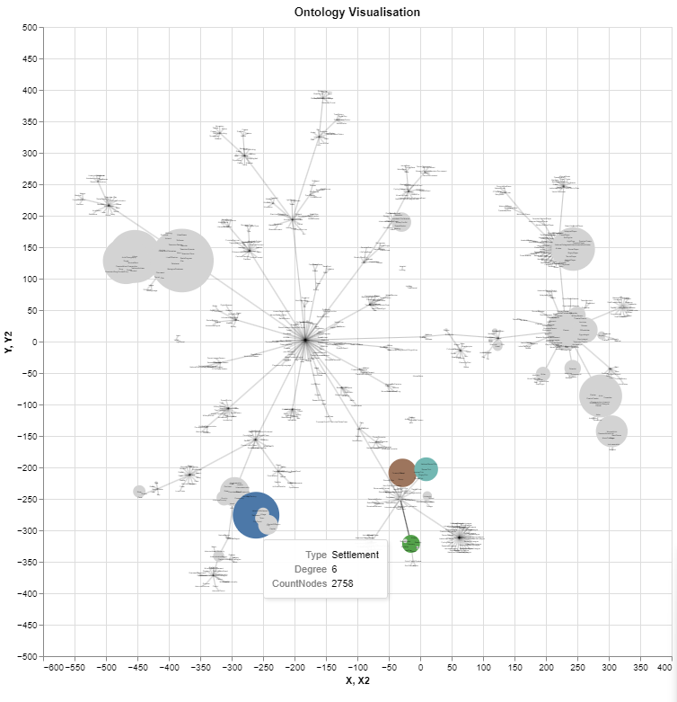

# Интерактивная визуализация

### Установка рабочего окружения

Для начала нужно скопировать проект в локальную папку на компьютере
Для этого нужно нажать зеленую кнопку Code и либо скачать zip-архив и распаковать его в удобное место, либо склонировать проект с помощью консольных команд
```bash
cd путь/к/проекту
git clone https://github.com/katzung/Entity-Alignment-Visualization.git`
```

Далее нужно установить необходимые для работы программы зависимости с помощью команды
```bash
cd путь/к/проекту
pip install -r requirements.txt
```
*Замечание*: Если для проекта **Подготовка данных к визуализации** уже были установлены зависимости, то этот пункт можно пропустить

Далее необходимо запустить проект **Подготовка данных к визуализации** с выбранными настройками и переместить его выходные данные в папку data

### Запуск программы

Для запуска программы нужно перейти в файл main.py и в нем установить значение переменной `alignmentAlgorithmOutputFilename` на значение переменной `outputFilename`, которое вы устанавливали в проекте **Подготовка данных к визуализации**. По умолчанию выбраны корректные имена для алгоритма MultiKE. Далее запустить программу как обычно.

### Инструкция по использованию визуализации

После работы программа выдает выходные данные в формате .html и кладет их в папку results. В итоге должны получиться 4 файла, которые можно открывать через браузер. Далее идет описание файлов:

- treemap_\*имя_файла\*.html - Treemap представление онтологии DBPedia. При наведении на квадрат конкретного типа показывается информация по нему(количество сущностей данного типа, количество сущностей включая его подтипы и тд.). По нажатию на квадрат изображение трансформируется, ставя его в верх иерархии. Сверху появляется полоса, показывающая путь до этого типа от типа owl#Thing.


- entities_\*имя_файла\*.html - Просмотр конкретной сущности и ее связей, выбор сущности осуществляется через выпадашку. При наведении на сущности показывается соответствующая информация. Выбранная сущность и ее эквивалент в наборе на другом языке выделены точками большего размера и связаны красным ребром.


- ontology_\*имя_файла\*.html - Результаты выравнивания вместе с графовым представлением онтологии (силовой алгоритм)


По нажатии на объект на любом из графиков на всех графиках выделяются все объекты с тем же типом. При зажатой клавише Shift можно выделять объекты сразу нескольких типов.





- entitiesWithTypes_\*имя_файла\*.html - Результаты выравнивания вместе с возможностью выбора сущностей по типу и просмотра конкретной сущности и ее связей по нажатию. Цветом выделен язык сущностей.


